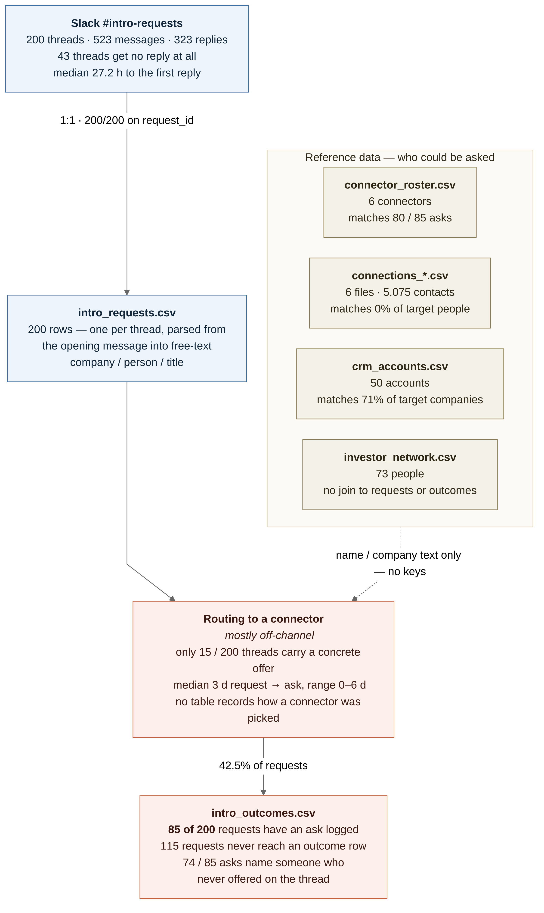

# Intro-request routing flow

Top-down view of how an intro request moves from Slack to a logged outcome, with the four
reference tables that feed the routing step. Figures come from `scoping/routing_kpis.md`,
`scoping/slack_thread_findings.md`, and `scoping/join_rates.md`.



Source: `scoping/routing_flow.mmd`. Regenerate with:

```
npx -y @mermaid-js/mermaid-cli@11 -i scoping/routing_flow.mmd -o scoping/routing_flow.png -b white -s 3
```

## Where the flow narrows

Slack to `intro_requests.csv` is lossless (1:1, 200/200). After that, only 15 of 200 threads
produce a concrete offer of help, and only 85 of 200 requests ever get an ask logged — 74 of those
85 name a connector who never spoke on the thread.

## Relational status

`request_id` is the only real key in the dataset. Every relationship that answers *who to ask* is a
fuzzy match between raw strings, so the pipeline is joined end-to-end on the request axis and
essentially unjoined on the people/company axis.

| Link | Type | Cardinality | Integrity |
| --- | --- | --- | --- |
| `slack_threads.request_id` -> `intro_requests.request_id` | key | 1:1 | 200/200 both directions, no duplicates |
| `intro_outcomes.request_id` -> `intro_requests.request_id` | key (FK) | 1:1 | 85/85 valid; covers 42.5% of requests; one row per request, so a second offerer on a thread cannot be recorded |
| `connector_roster.connections_file` -> `connections_*.csv` | key (filename) | 1:1 | 6/6 resolve — the only clean link into the network data |
| `intro_outcomes.connector_asked` -> `connector_roster.name` | text | many:1 | 80/85 rows match; 5 asks name off-roster people (Bertrand Vandermolen, Curtis Hartigan, Hana Nakashima, Imani Mkhize, Yusuf Petrossian) |
| `intro_requests.target_company_raw` -> `crm_accounts.account_name` | text | many:1 | 65% exact, 71% after normalization; `domain` variant only 35% |
| `intro_requests.target_person_raw` -> `connections_*.name` | text | many:many | **0% at every normalization tier** |
| `intro_requests.requested_by` -> `crm_accounts.owner` | text | many:1 | 100% (8 requesters, all account owners) |
| `investor_network.person` -> `connector_roster.name` | text | many:1 | 2.4% |
| `crm_accounts.account_id` | PK | — | referenced by no other table |

Three consequences worth stating plainly:

1. **The routing step has no representation in the data.** No column records which connector was
   considered, why one was chosen, or what evidence was used — `intro_outcomes` only records the
   end state. Any claim about *how* routing happens is inferred from timing and thread text.
2. **The reference tables cannot currently support routing.** The requested person is never in any
   connector's network (0%), and `investor_network` never connects to a request or an outcome, so
   the two tables that would identify a warm path contribute nothing joinable.
3. **The one workable path is company-level.** `target_company_raw` -> `crm_accounts.account_name`
   at 71% is the only substantial fuzzy link, which means routing today can at best be "who owns
   this account", not "who knows this person".
