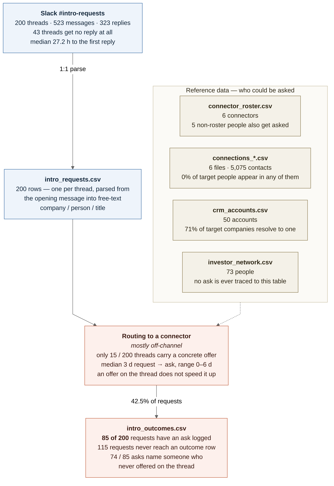

# Intro-request routing flow

Top-down view of how an intro request moves from Slack to a logged outcome, with the four
reference tables that feed the routing step. Figures come from `scoping/routing_kpis.md`,
`scoping/slack_thread_findings.md`, and `scoping/join_rates.md`.



Source: `scoping/routing_flow.mmd`. Regenerate with:

```
npx -y @mermaid-js/mermaid-cli@11 -i scoping/routing_flow.mmd -o scoping/routing_flow.png -b white -s 3
```

The pipeline narrows at two points. Slack to `intro_requests.csv` is lossless (1:1), but only
15 of 200 threads produce a concrete offer of help, and only 85 of 200 requests ever get an ask
logged — 74 of those 85 name a connector who never spoke on the thread. The reference tables
explain part of the gap: target companies resolve to a CRM account 71% of the time, while target
people match a connector's contact list 0% of the time, so there is no data path from a request to
a warm connector even when one exists.
